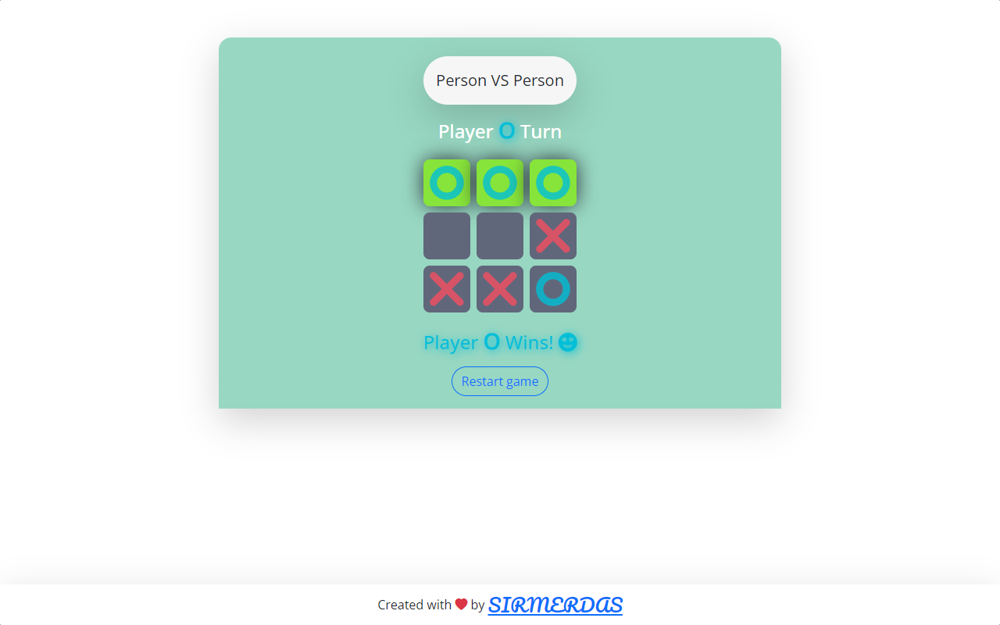

# Front End projects - A repository that you can find my training projects.

 

## List of current projects :

- [Simple music player app](#music-player-app).
- [TicTacToe game](#tictactoe-game).

### Music player app

Simple web based music player that you can download and use it on your website if you need it.Check the live version on here:

##### https://sirmerdas.github.io/Front-End-Projects/musicPlayer/

#### screenshots

---

### TicTacToe game

Web based TicTacToe game that support person vs person and also person vs computer.
Take a look😀, play🤗, Have fun😍.

#### Live version : https://sirmerdas.github.io/Front-End-Projects/TicTacToe/

### screenshots

---

### Author:

### [sirmerdas](https://sirmerdas.ir)
