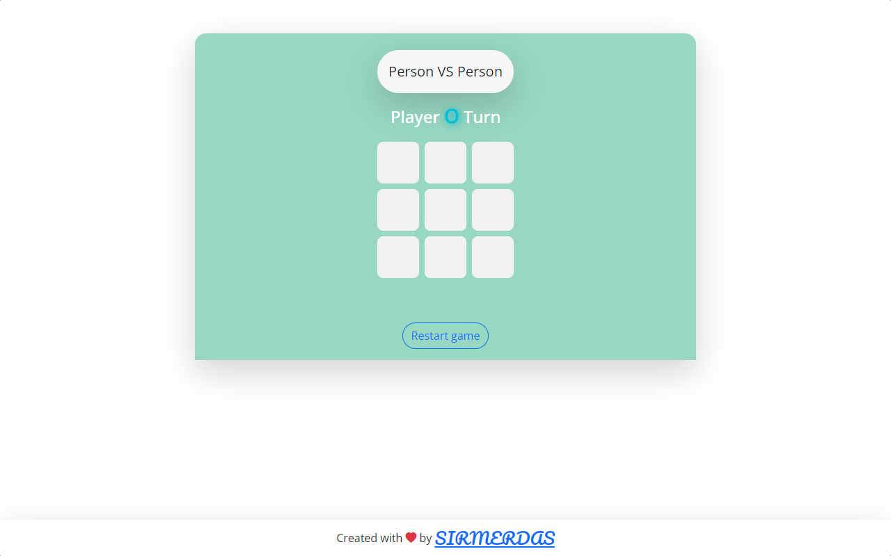

# Tic-Tac-Toe game

Web based tic tac toe game, Hope you enjoy it ❤.

---

## Table of contents

- [Screenshots](#screenshots)
- [Links](#links)
- [Built with](#built-with)
- [Author](#author)

### Screenshot

## Player VS CPU

---

## Player VS Player

---

## End game

---

### Links

#### Live Site URL: [https://sirmerdas.github.io/Front-End-Projects/TicTacToe/](https://sirmerdas.github.io/Front-End-Projects/TicTacToe/)

---

## Built with

- Semantic HTML5 markup
- CSS custom properties
- Javascript
- Mobile-first workflow
- [Bootstrap](https://getbootstrap.com/) - Css framework
- [Bootstrap-icons](https://icons.getbootstrap.com/) - Amazing icons
- [Google fonts](https://fonts.google.com/) - Open sans

## Author

- Website - [Sir Merdas](https://sirmerdas.ir/)
