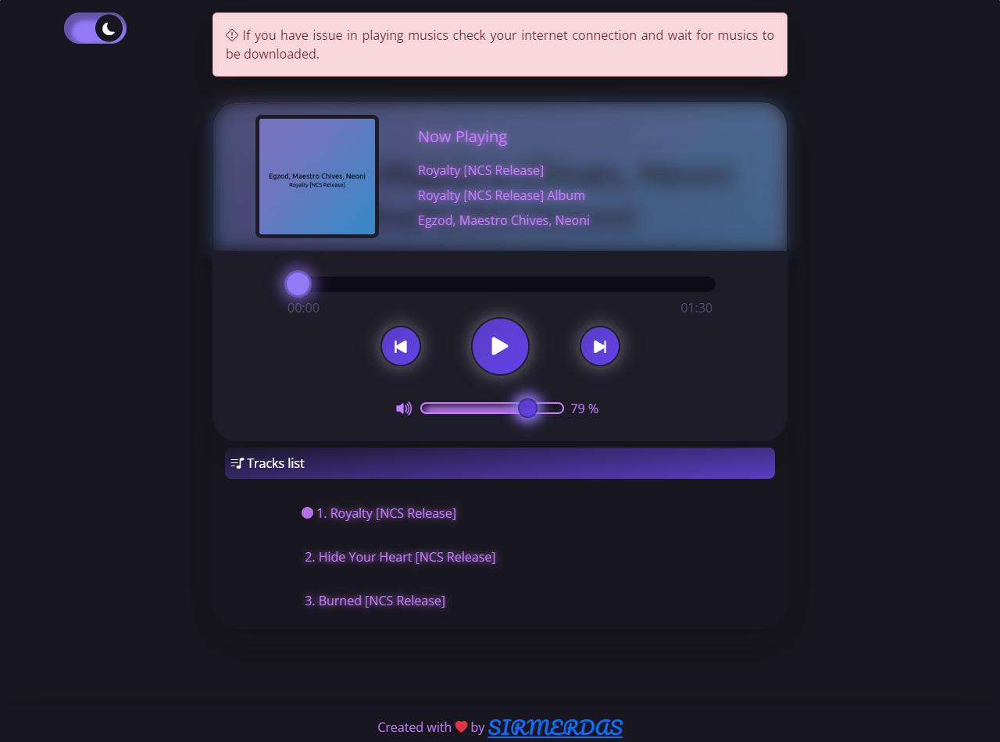
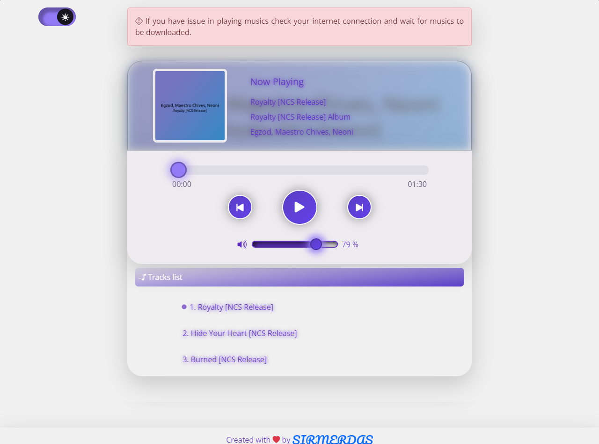

# Music player App

This is a simple web based music player app that you can use and enjoy it😍.

---

## Table of contents

- [Screenshots](#screenshots)
- [Links](#links)
- [Built with](#built-with)
- [Used musics](#used-musics)
- [Author](#author)

### Screenshots

## Dark mode

## Light mode

---

### Links

#### Live Site URL: [https://sirmerdas.github.io/Front-End-Projects/musicPlayer/](https://sirmerdas.github.io/Front-End-Projects/musicPlayer/)

---

# Used musics:

### I don't own any musics used in this projects and I got them from here👇:

- https://ncs.io/Royalty \
  Song: Egzod, Maestro Chives, Neoni - Royalty [NCS Release] \
  Music provided by NoCopyrightSounds \
  Free Download/Stream: http://ncs.io/Royalty \
  Watch: http://youtu.be/C5fLxtJH2Qs

---

- https://ncs.io/hideyourheart \
  Song: VOLT VISION, BRIGHTDVWN - Hide Your Heart [NCS Release] \
  Music provided by NoCopyrightSounds \
  Free Download/Stream: http://ncs.io/hideyourheart \
  Watch: http://ncs.lnk.to/hideyourheartAT/youtube

---

- https://ncs.io/Burned \
  Song: Henri Werner - Burned [NCS Release] \
  Music provided by NoCopyrightSounds \
  Free Download/Stream: http://ncs.io/Burned \
  Watch: http://ncs.lnk.to/BurnedAT/youtube

---

## Built with

- Semantic HTML5 markup
- CSS custom properties
- Javascript
- Mobile-first workflow
- [Bootstrap](https://getbootstrap.com/) - Css framework
- [Bootstrap-icons](https://icons.getbootstrap.com/) - Amazing icons
- [Google fonts](https://fonts.google.com/) - Open sans

## Author

- Website - [Sir Merdas](https://sirmerdas.ir/)
